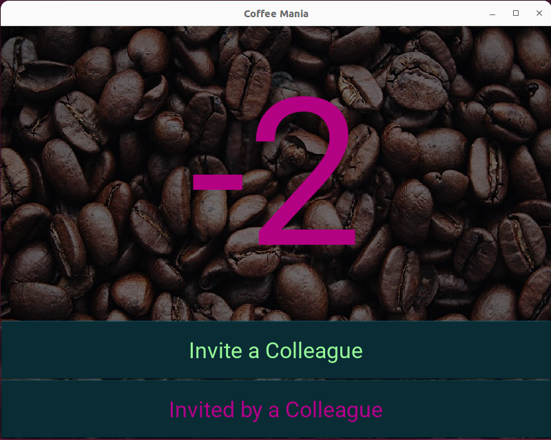

# Coffee mania
a small application developed for me and my colleague.
Since we are both coffee lovers and often one of us is missing small coins, we invite each other =].

And since we both don't want to owe each other anything, I developed a small application in python (after conversion to android mobile) that records the number of invitations.
- positive number = I invited a colleague
- negative number = I am invited by a colleague
- zero = we are balanced.

